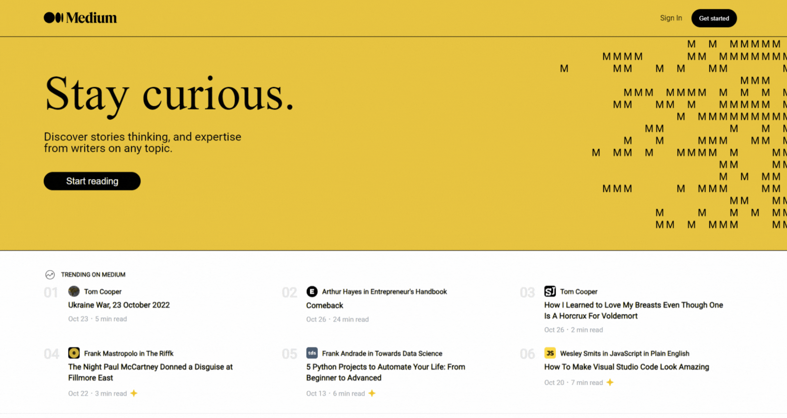

## Medium:

For the Epicode bootcamp, I have created a faithful replica of the renowned online publishing platform, Medium. Using HTML, CSS, and JavaScript along with the powerful flexibility of Flexbox, I have crafted a user interface that captures the essence and clean design of Medium. My replica emulates only the aesthetic appeal of the original site.

## Key Features:

- Completely responsive;
- The task was to align all the sections using FLEXBOX;
- "M" animation with ;

## Tech Stack

**Client:**

## Author

